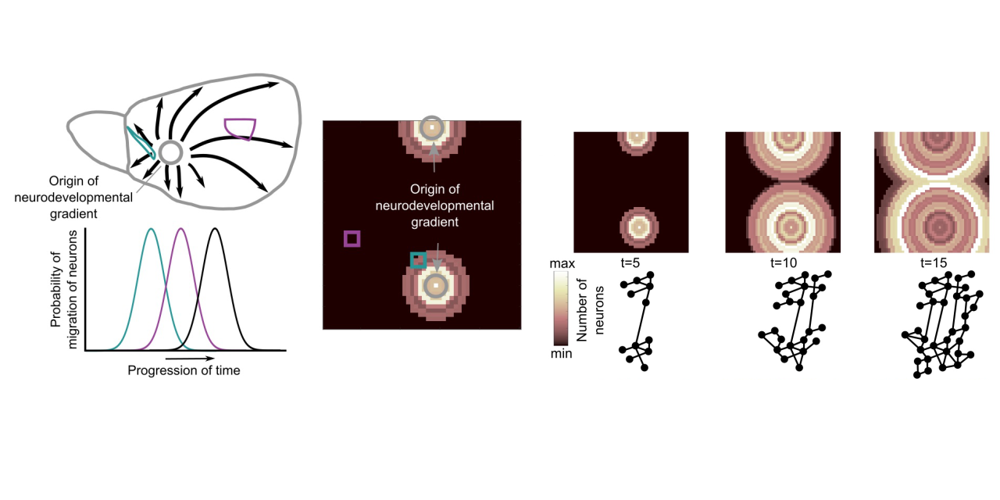

# Connectome ontogenesis
Generative model of the spatiotemporal development of complex networks (brain connectomes)


# Description

This set of functions allows the simulation of the spatiotemporal development of synthetic neuronal networks (connectomes). The generative model aims at mimicking the development of neuronal networks and explaining the intricate topology of such neuronal networks solely based on two fundamental dimensions, that is, space and time. The core idea is that the mere fact that neuronal networks are inhabiting space and time, these fundamental dimensions pose in and by themselves contraints on the formation of conenctions and thus result in non-trivial intricate topologies observed in empirical biological neuronal networks. 

The synthetic neuronal networks generated from this model can be subsequently directly and quantitevely compared with empirical biological neuronal networks connectomes, since such comparisons were explicitly taken into account in the design of the generative model. Therefore, this neurobiologically-informed generative model can elucidate to what extent the observed empirical "adult" connectomes can be understood in light of the parsimonious neurodevelopmental mechanism that this generative model instantiates.

For details see:
Goulas A, Betzel R, Hilgetag C (2019) Spatiotemporal ontogeny of brain wiring. Science Advances. 5(6):eaav9694. http://doi.org/10.1126/sciadv.aav9694

# Installation

Download or clone this repository and add all the folders to your Matlab path.

# Example

Tested with Matlab 2016a.

To generate synthetic neuronal networks, it is better to use the included functions in a wrapper function to generate networks across a range of parameters. An example of such wrapper function is included in the examples folder (generate_synthetic_nets_batch.m). Let's see how you can run this wrapper:

```
%Please see the documentation of the functions for the meaning and nature of these parameters

nr_of_sheets=10;
size_of_sheets=[30 30];
nr_of_gradients=2;
range_of_a=[0.2 0.4];    
temporal_resolution=0.1; 
neuron_rate=0.1;
neurons=100;
distance_to_connect=0.5;
occupancy_thres=100;
time_windows_mode='gradients';
name='test';

generate_synthetic_nets_batch(nr_of_sheets, size_of_sheets, nr_of_gradients, range_of_a, temporal_resolution, neuron_rate, neurons, distance_to_connect, occupancy_thres, time_windows_mode, name)
```

The above wrapper function will create synthetic neuronal networks with the combination of the parameters range_of_a and nr_of_gradients. It will store the results in an orderly manner, that is, in seperate folders with the names of the parameters used as the names of the folders. 

The above setup will generate the following folders in your current working folder in MATLAB: 

alpha_0.2nr_of_gradients2, alpha_0.4nr_of_gradients2

Each folder contains a struct named as name (here =test). These structs contain all the info on the generated neuronal networks. Load the struct in your workspace. The struct now appears with the name TotalData.

The fields AllCorticalSheet and AllConnList contain all the info needed to convert the neuron-to-neuron networks to region-to-region networks (the rest of the fields contain info on the way that the stored synthetic networks were generated). This is desired since most empirical biological networks are summarized as region-to-region connectivity matrices. However, the generated neuronal networks can be subsequently analyzed as neuron-to-neuron matrices, that is synthetic cellular resolution neuronal networks.

Converting the neuron-to-neuron networks to region-to-region networks is achieved as follows:

Generate a parcellation scheme of the synthetic sheet. For instance, containing 50 regions ("brain divisions"):

```
size_of_sheets=[30 30];
regions=50;
[Areas, XY]=TasselatePoints2Areas(size_of_sheets, regions);
```

Now Areas is a 2D matrix with unique integers denoting each one of the 50 regions.

Based on the regional division, the geenrated network can be sumarized as a region-to-region network:

```
[C, Dist]=AssembleAreaWiseMatrix(TotalData(1).AllConnList, Areas)
```

This will create a region-to-region connectome (neuronal network) with the first (TotalData(1)) synthetic network that was generated based on the regional divisions dictated by Areas.

Note that Dist is the region-to-region distance matrix of the synthetic network.

This conversion allows to compare the generate neuronal networks with empirical neuronal networks. E.g., if an empirical neuronal network is sumamrized as a 49x49 regional matrix, running the above conversion functions with regions=49 allows the direct quantiative comparisons of synthetic and empirical networks. 

This property opens up many avenues to elucidate more regidly what exact mechanisms might give rise to the itnricate topology that is observed in biological neuronal networks across multiple species.

# Citation

Goulas A, Betzel R, Hilgetag C (2019) Spatiotemporal ontogeny of brain wiring. Science Advances. 5(6):eaav9694. http://doi.org/10.1126/sciadv.aav9694
